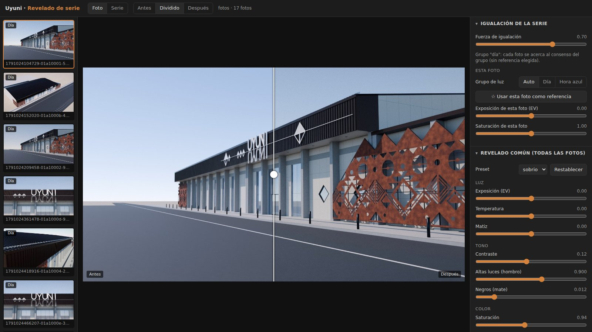

# Revelado de serie: un "Lightroom a medida" para las fotos de Uyuni

`unificar_color.py` toma la carpeta de imágenes generadas con IA y las revela como si las hubiera tomado y procesado **una sola persona, con una sola cámara**.

Cada herramienta de IA deja su propia firma: dominante de color, exposición, contraste, saturación y tono de cielo. El programa:
1. **Separa la serie por luz.** Pone en un grupo las fotos de **día** y en otro las de **hora azul**. Lo detecta por el brillo del cielo, sin depender del nombre del archivo.
2. **Iguala cada foto con su grupo.** Las acerca al consenso del grupo, o a la foto que marques como referencia ★, en cinco aspectos:
   - el color de la luz;
   - el brillo de lo iluminado;
   - el punto negro y el punto blanco;
   - la saturación;
   - el tono del cielo y del corten.
3. **Aplica a todas el mismo revelado:** temperatura, exposición, curva con hombro en las altas luces, saturación, vibrancia, virado (sombras frías, luces cálidas), nitidez, grano y viñeteo.
4. **Exporta:**
   - las fotos;
   - una hoja **antes/después** (`_comparacion.jpg`);
   - un informe (`_informe.json`);
   - si lo pides, LUT `.cube` por foto, para Photoshop o DaVinci.

**No modifica los originales:** todo se guarda en `serie_unificada\`, dentro de la misma carpeta. Los archivos que no son imágenes, como el `.docx`, se ignoran.

## Cómo abrirlo en Windows

Necesitas **uv**, el mismo que usaste para el MCP de Blender. La primera vez instala Python, numpy y Pillow por su cuenta.

**Opción A, arrastrar y soltar:**
1. Copia `unificar_color.py` y `Revelado_Uyuni.bat` a una misma carpeta.
2. Arrastra la carpeta de las fotos sobre `Revelado_Uyuni.bat`.
3. Se abre el navegador con la aplicación. La ventana negra tiene que quedar abierta mientras trabajas.

**Opción B, desde la terminal:**
```
cd "C:\Users\Joaco\Downloads\Claude Code proyecto_TP_Uyuni"
uv run unificar_color.py --app "C:\Users\Joaco\Downloads\Claude Code proyecto_TP_Uyuni\Renders"
```
Si `unificar_color.py` está en otra carpeta, ajusta el `cd`. Las comillas son necesarias porque la ruta tiene espacios.

**En lote, sin interfaz:** procesa toda la carpeta con los últimos ajustes guardados.
```
uv run unificar_color.py "C:\Users\Joaco\Downloads\Claude Code proyecto_TP_Uyuni\Renders"
```

Sin uv también funciona: instala las dependencias con `py -m pip install numpy pillow` y ejecuta `py unificar_color.py ...`.

## La aplicación



| Zona | Qué hay |
|---|---|
| Izquierda | La tira de fotos, con su grupo ("Día" u "Hora azul") y una ★ en la referencia. |
| Centro, vista **Foto** | La foto seleccionada en **Antes**, **Después** o **Dividido**. En "Dividido", el divisor se arrastra. |
| Centro, vista **Serie** | Todas las fotos ya reveladas, juntas: ahí se ve si parecen de una misma sesión. |
| Derecha, **Igualación** | **Fuerza de igualación** (0 = no iguala; 0,7 por defecto). Para la foto elegida: grupo (Auto, Día u Hora azul), botón ☆ para usarla como referencia y ajustes finos de exposición y saturación. |
| Derecha, **Revelado común** | Preset (*sobrio*, *neutro* o *cálido*) y deslizadores. Todos los cambios se aplican a la serie entera. |
| Derecha, **Exportar** | Formato (JPG, PNG o TIFF), calidad, tamaño, LUT y el botón **Exportar serie**. |

**Atajos:**
- <kbd>←</kbd> <kbd>→</kbd> cambian de foto.
- <kbd>\\</kbd> alterna entre antes y después.
- <kbd>G</kbd> abre la vista Serie.

Los ajustes se guardan solos en `_ajustes_revelado.json`, dentro de la carpeta de fotos. Al volver a abrirla, todo queda como lo dejaste.

## Flujo recomendado (10 minutos)

1. **Revisa los grupos.** Si una foto de hora azul quedó como "Día", o al revés, corrígela en *Esta foto > Grupo de luz*.
2. **Elige la referencia, si quieres.** Si una foto ya tiene el color que buscas, márcala con ☆ y todas las de su grupo se acercarán a ella. Si no marcas ninguna, se usa el consenso del grupo.
3. **Ajusta el revelado común mirando la vista Serie,** no una sola foto. Para un estilo sobrio de altiplano:
   - el preset *sobrio*;
   - temperatura entre 0 y +0,15;
   - contraste entre 0,10 y 0,18;
   - grano bajo.
4. **Haz ajustes finos por foto** solo si alguna sigue destacando, con la exposición o la saturación de esa foto.
5. **Exporta y revisa `_comparacion.jpg`.**

## Qué no hace

- **No corrige la geometría ni los errores de la IA:** letras deformadas, patrones cambiados o personas mal resueltas siguen ahí. Hay que revisarlos antes, con el control de `PROMPTS_IA_RENDERS.md`.
- **No convierte día en noche.** Las dos luces se igualan por separado, a propósito.
- **No hace milagros con escenas muy distintas.** Si una foto se aleja demasiado de la serie, con otra hora del día o un cielo muy distinto, la igualación la acerca pero no la iguala del todo. Conviene regenerarla con el mismo prompt.

## Cómo se probó

Se armó una serie de prueba parecida a la tuya:
- 17 fotos sacadas de las vistas del modelo, cada una alterada al azar en dominante de color, exposición, contraste, saturación, tono del cielo y nitidez;
- nombres numéricos y descriptivos, PNG y JPEG mezclados, tamaños y proporciones distintos;
- un `.docx` en la misma carpeta.

Resultados:
- La clasificación día/hora azul acertó en las 17 fotos.
- Entre las fotos de día, la diferencia de color de la luz bajó ≈ 70 % y la del tono del cielo pasó de 12° a 3°.
- Comparadas contra los renders sin alterar, la diferencia de color entre fotos bajó entre un 40 % y un 65 %, según el eje de color.
